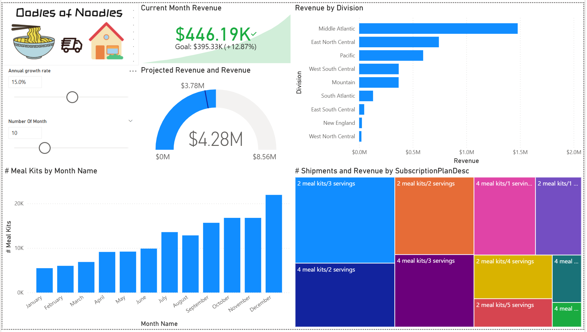
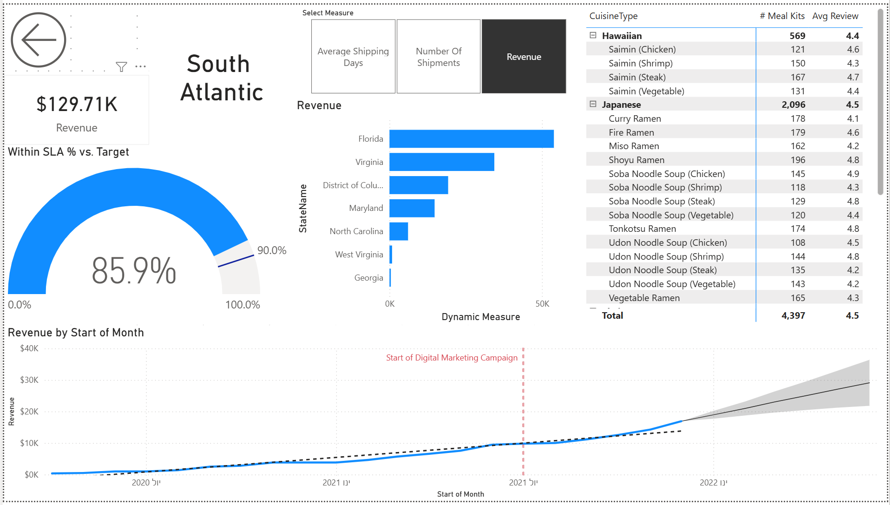

# 🍜 Oodles & Noodles – Business Intelligence Dashboard

## 📌 Overview

This project presents an interactive **Business Intelligence dashboard** built using Power BI for *Oodles & Noodles*, a fictional food delivery company.

The dashboard provides comprehensive insights into business performance, revenue trends, customer behavior, and operational efficiency, enabling data-driven decision making.

---

## 🎯 Project Objectives

- Analyze revenue performance across regions and divisions
- Track key KPIs such as revenue, SLA performance, and customer activity
- Evaluate shipment trends and customer engagement
- Perform time-based analysis using advanced DAX functions
- Identify top-performing products and categories

---

## 📊 Dashboard Features

### 🔹 KPI Monitoring

- Revenue tracking
- SLA performance vs. target
- Average shipping days
- Number of shipments

### 🔹 Revenue Analysis

- Revenue by state and division
- Monthly revenue trends
- Campaign impact visualization

### 🔹 Customer & Product Insights

- Meal kits distribution by month
- Revenue and shipments by subscription plan
- Cuisine-level analysis with ratings

### 🔹 Advanced Analytics

- Time Intelligence analysis
- Forecasting and projected revenue
- Ranking and Top-N analysis using DAX (`RANKX`, `TOPN`)

---

## 🛠️ Tools & Technologies

- **Power BI**
- **DAX (Data Analysis Expressions)**
- Data Modeling
- Business Intelligence & Analytics

---

## 📸 Dashboard Preview

### Main Dashboard

### Division Analysis

---

## 📂 Project Structure

- `Oodles_of_Noodles.pbix` – Main Power BI report
- `images/` – Dashboard screenshots
- `README.md` – Project documentation

---

## ▶️ How to Use

1. Download the `.pbix` file from this repository  
2. Open it using **Power BI Desktop**  
3. Explore the interactive dashboards and filters  

---

## 📈 Key Insights

- Strong revenue growth driven by digital marketing campaigns  
- High-performing divisions contributing the majority of revenue  
- Seasonal trends in meal kit demand  
- Premium subscription plans contributing significantly to total revenue  

---

## 💼 Business Value

This dashboard transforms raw data into actionable insights by:

- enabling real-time performance tracking  
- supporting strategic decision-making  
- improving operational visibility  
- identifying growth opportunities  

---

## 👤 Author

**Zion Memun**  
B.Sc. Data Science and Engineering Student